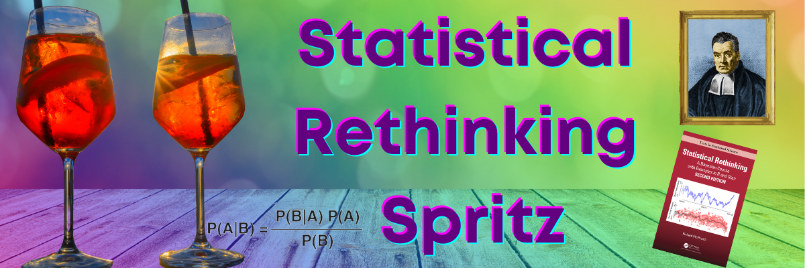

Hi there, and thanks for your interest. In this study group, we will work on the famous "Statistical Rethinking" book by Richard McElreath. It is a course on Bayesian Statistics, but regardless of the methods, it contains valuable insights into how we think of data and science. In addition to the book, there is also a set of videos made publicly available by McElreath.

## What will we do?
**First of all, we'll keep each other accountable**. We all have busy schedules, and it is easy to sacrifice self-study hours when something more urgent comes up. So the first thing is to set a fixed schedule to study each chapter. And with a group of friends, it is much easier and fun to follow it.

Besides that, we can **watch lecture videos together**. Most of them are between 1h and 1h20mins. We can watch these over zoom, and then **discuss and solve some of the questions together** at the end of each chapter. 

As the name of the group suggests, I imagined that we'd gather around aperitivo time, so we could eat and drink at the same time. If you prefer to watch the videos alone, you can join the discussion session only. 

## How long will it take?
It depends on how often we'd like to meet. I thought that most people prefer to meet every two weeks as once a week would probably be too demanding. But we can decide together in the first meeting.

The video sessions would take around 1h 30minutes each. We can restrict the following discussion to 30 minutes and have two-hour meetings. 
I think even watching the videos only would be sufficient, but during these two weeks, if you study the relevant chapter, I guess it might take another hour for you, depending on how deeply you get involved with the material.

## Audience
The book defines the target audience as:

> The principal audience is researchers in the natural and social sciences, whether new PhD students or seasoned professionals, who have had a basic course on regression but nevertheless remain uneasy about statistical modeling.

Feel free to refer friends as long as they commit to the rules.

## The book
The book is this one:

McElreath, R. (2020). _Statistical rethinking: A Bayesian course with examples in R and Stan_. Chapman and Hall/CRC.

Here is some more information about it: https://xcelab.net/rm/statistical-rethinking/

It is an expensive book but feel free to send me an e-mail. I should have some extra copies of it.

